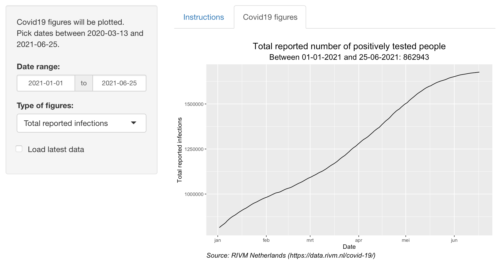

```{r setup, include=FALSE}
knitr::opts_chunk$set(echo = FALSE)
```

## Insight in figures
The app shows official Covid19 figures of the Netherlands.  
Here's a screenshot:

{width=700px}

## Features
The app provides the user with different views:  

- Types of figures:
    + Total reported infections
    + Hospital admission
    + Deceased
- Specify a period of time

The figures can be updated with the latest data provided by the source:  
RIVM Netherlands (https://data.rivm.nl/covid-19/)

## The data
Raw data is cleaned and transformed to contain only data that is needed.  
Example of the cleaned data:
```{r, echo=FALSE, message=FALSE, warning=FALSE, comment=""}
library(lubridate)
library(dplyr)

df <- read.csv2("COVID-19_aantallen_gemeente_cumulatief.csv")
df$Date_of_report <- as.Date(ymd_hms(df$Date_of_report))
df["Province"][df["Province"] == "Fryslân"] <- "Friesland"
# Remove empty Provinces
df <- df[df$Province!="",]
df <- df %>%
    group_by(Date_of_report) %>%
    summarise(Total_reported = sum(Total_reported), Hospital_admission=sum(Hospital_admission), Total_deceased=sum(Deceased))
tail(df, 10)
```

## Links
The app is deployed on shinyapps.io:  
https://f1cmhm-pbruynel.shinyapps.io/DSS-09-DevelopingDataProducts-Week4-PeerAssignment/  

The code is made public and available on github.com:  
https://github.com/pbruynel/DSS-09-DevelopingDataProducts-Week4-PeerAssignment

The data is made publicly available by RIVM Netherlands:  
https://data.rivm.nl/covid-19/

